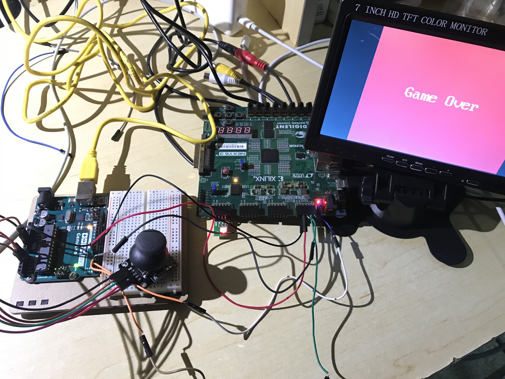
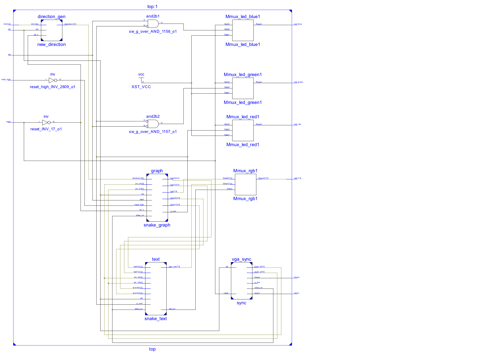
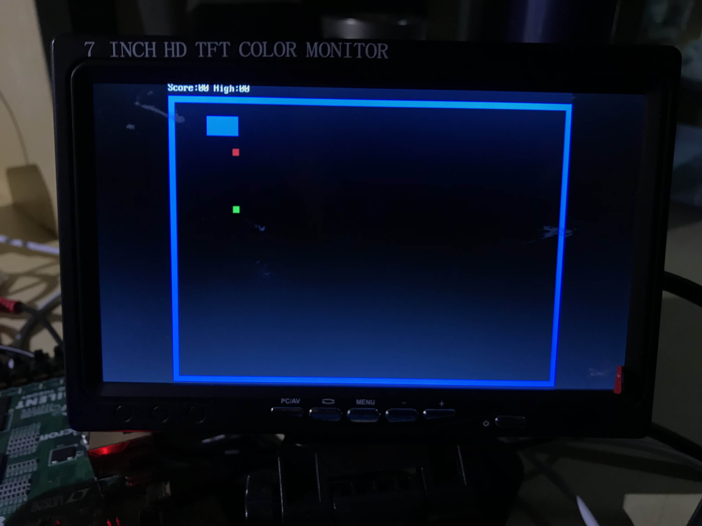
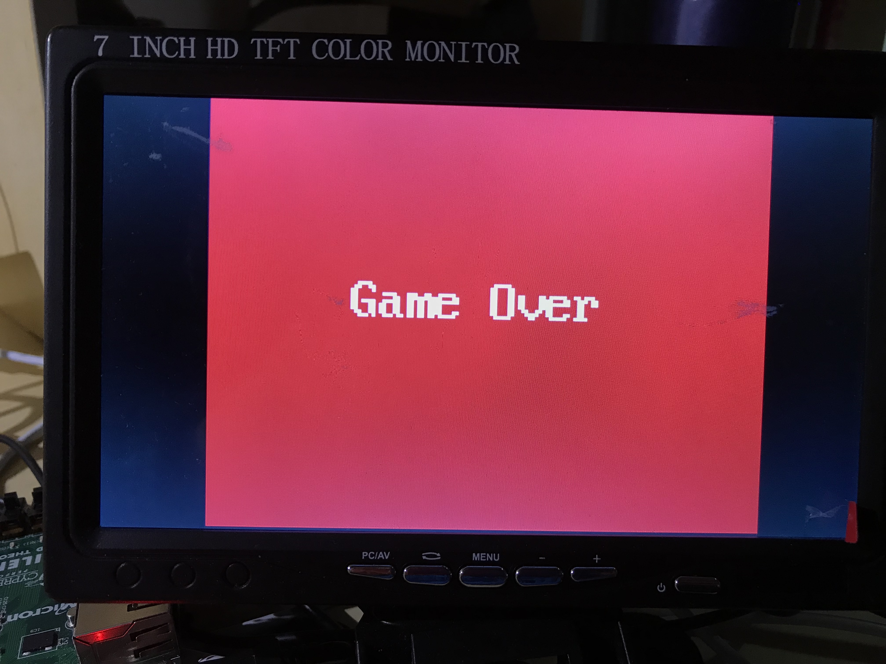

# 综合设计 - 贪吃蛇游戏
## 平台与外设
- Digilent Nexys3 FPGA开发板
- VGA 显示器
- Arduino UNO R3 单片机
- XY摇杆一个
- 三色LED灯一个
- 拨动开关一个

## 模块设计
### 原理图

### 模块说明
- `graph`模块处理贪吃蛇游戏的逻辑部分并且负责输出游戏图像，显示边界、蛇、食物。在死亡时（撞到边界或者撞到蛇🐍的身体时）将屏幕置为纯红色。
- `text`模块用于显示点阵文字，点阵文字以16\*8的点阵将128个标准ASCII字符保存在IP核初始化的ROM中，IP核ROM大小为2048\*8，地址11位，每个地址保存8个二进制位，分别对应16\*8的点阵文字的每一行8个二进制位，地址的高7位对应ASCII码，低4位对应显示的行。
- `vga_sync`模块用于VGA信号的同步，VGA采用`640*480@60Hz`输出，产生`hsync`和`vsync`信号发送至VGA接口，同时输出`pixel_x`和`pixel_y`以及`video_on`，分别指示当前输出的像素，介于(0,0)和(639,479)之间，以及当前是否在图像输出状态（而不在边界位置）
- `MMux_rgb1`用于选择来自`graph`的RGB输出值还是`text`的RGB输出值
- `direction_gen`用于接受IO引脚来自Arduino单片机的数字信号输入，分别是操控蛇的上下左右移动的信号，并且产生当前蛇移动的方向，输入到`graph`模块。其包含去抖动，以及记录上一时刻在没有输入的情况下蛇移动的方向。同时保证蛇不会反方向移动，保证自己不会咬到自己。
## 设计说明
- XY摇杆🎮输出的是模拟信号，Arduino单片机拥有模拟输入信号接口，可以读入1024个不同的电压值。故将摇杆连接到Arduino UNO上，将其转换成数字信号再接入Nexys3开发板。
- 拨动开关sw<0>可以选择难度，拨动至高电平将选择困难模式，低电平则为简单模式。困难模式会在屏幕中多一个障碍物，并且蛇的移动会加快，更加难以控制。
- 蛇每吃一个事物增加一个单位长度，并且得分加1。
- 当前得分及最高分会显示在屏幕左上角。
- 撞到边界或蛇自身死亡，屏幕全红，并且显示"Game Over"字样。
- 中间按钮`btns`重置游戏，上方按钮`btnu`清零最高分。
- 三色LED灯插在IO引脚上，可以显示当前游戏状态（难度/是否死亡）
## 核心思想
- 蛇身使用寄存器「数组」来记录，最大蛇长32，每个7位的`reg`记录蛇这块身体在屏幕上的位置除以10的值。每次蛇移动时首先通过Verilog中的`for`语句来对蛇身位置更新，再根据蛇移动的方向来更新蛇头的位置。
- 每次在蛇的位置更新时（clk_update时钟而非clk时钟），判断蛇是否吃到了食物，吃到了食物则得分加一，重新生成新的食物的位置。若使用100MHz的输入时钟clk，则会蛇长每次随机增加一个不定的值。
- 边界的显示采用一个`wire`，当VGA信号扫描到应该显示边界的位置时，则将该信号置为高电平，实现如下
```
assign border_on = (hard) ?
    (((pix_x >= 0) && (pix_x < 10) && (pix_y >= 20)) || ((pix_x >= 630) && (pix_x < 640) && (pix_y >= 20)) || ((pix_y >= 20) && (pix_y < 30)) || ((pix_y >= 470) && (pix_y < 480)) 
    || (pix_x >= 60 && pix_x < 110 && pix_y >= 50 && pix_y < 80))
    :
    (((pix_x >=0) && (pix_x < 10) && (pix_y >= 20)) || ((pix_x >= 630) & (pix_x < 640) && (pix_y >= 20)) || ((pix_y >= 20) && (pix_y < 30)) || ((pix_y >= 470) && (pix_y < 480)));
```
- 随机数的产生：采用计数器产生伪随机数，从而产生食物的位置
- VGA信号的同步控制
- 字体的显示，将16*8点阵文字放在IP核初始化的ROM中，构造ROM地址使得地址的高7位对应ASCII码，低4位对应显示的行。并且通过控制在当前扫描像素位置满足一定条件时输出文字来控制字体的缩放。死亡时显示的"Game Over"字体便为4倍缩放
- 模拟信号转换成数字信号，采用Arduino编程
## 运行效果
### 截图



### 视频
[Demo Video](https://github.com/libertyeagle/fpga_snake/blob/master/demo/demo.m4v "Demo")
## 可改进部分
- 增加关卡难度
- 增加读档存档功能
- 增加蛇的图案的设计
- 增加蜂蜜器
- 增加游戏菜单
## Arduino代码
```
int VRX = A0;
int VRY = A1;
int SW = A2;
int L = 1;
int R = 2;
int U = 3;
int D = 4;
int x, y;
bool left = false, right = false, up = false, down = false;

void setup() {
  pinMode(VRX, INPUT);
  pinMode(VRY, INPUT);
  pinMode(L, OUTPUT);
  pinMode(R, OUTPUT);
  pinMode(U, OUTPUT);
  pinMode(D, OUTPUT);
}

void loop() {
  x = analogRead(VRX);
  y = analogRead(VRY);
  if (x > 1010) {
    left = false;
    right = true;
    up = false;
    down = false;
  }
  else if (x < 15) {
    left = true;
    right = false;
    up = false;
    down = false;
  }
  else if (y > 1010) {
    left = false;
    right = false;
    up = false;
    down = true;
  }
  else if (y < 15) {
    left = false;
    right = false;
    up = true;
    down = false;
  }
  else {
    left = false;
    right = false;
    up = false;
    down = false;
  }
  digitalWrite(L, left);
  digitalWrite(R, right);
  digitalWrite(U, up);
  digitalWrite(D, down);
}
```
